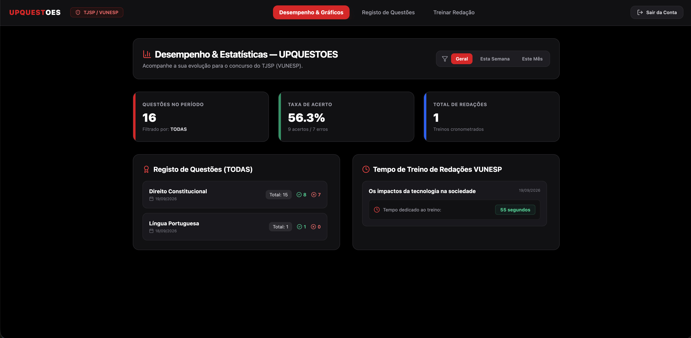

 

 

---
 

  
### `🫅 UM POUCO SOBRE MIM 🫅`
  

Sou **Desenvolvedor Full-Stack, Automação e Dados**, atuando no setor de saúde na **Cerba Internacional / DMS Burnier**.

Gosto de entender primeiro **a regra de negócio e o problema que precisa ser resolvido** e, a partir disso, transformar a necessidade em uma solução organizada, previsível e escalável.

Meu foco está em construir aplicações que unem **lógica, dados, automação e boas práticas de desenvolvimento**.

Atualmente, meu principal foco está em:

* 🟠 Desenvolvimento de aplicações **Full-Stack**
* 🤖 Uso de **Inteligência Artificial** para engenharia de código
* 🧠 Utilização de **Gemini e Claude** no processo de desenvolvimento
* 🗄️ Manipulação de bancos relacionais com **PostgreSQL e Supabase**
* 🔌 Criação e integração de **APIs**
* 📊 Desenvolvimento de sistemas e painéis para análise de dados
* 🧩 Implementação de regras de negócio
* 🔄 Automação de processos e rotinas
* ☁️ Desenvolvimento de aplicações preparadas para Cloud

Também possuo formação em **Análise e Desenvolvimento de Sistemas pela UniCesumar**, além de experiência prática com Git, GitHub, bancos de dados, infraestrutura e desenvolvimento de aplicações.

 

---
  

### `🥷 TECNOLOGIAS` 
  

### Linguagens & Desenvolvimento

  

### Bancos de Dados

  

### Ferramentas & Cloud

---

  

### `⌁ MEU STACK`

  

<table align="center">
<tr>

<td width="50%" valign="top">

### 🧡 Full-Stack & IA

<pre>
Next.js / React  ████████████████████  principal
TypeScript       ███████████████████░  experiência
Node.js          █████████████████░░░  experiência
Python / IA      ████████████████░░░░  Gemini
Lógica & Clean   ████████████████████  boas práticas
</pre>

</td>

<td width="50%" valign="top">

### 🗄️ Dados & Backend

<pre>
SQL              ███████████████████░  experiência
PostgreSQL       ███████████████████░  principal
Supabase         █████████████████░░░  experiência
MySQL            ███████████████░░░░░  experiência
MongoDB          █████████████░░░░░░░  experiência
APIs             █████████████████░░░  experiência
</pre>

</td>

</tr>
</table>

---
  

###  ⚙️ `ferramentas que fazem parte do meu dia`
  

---
  

### `🎯 UPQUESTOES`

  

### Plataforma de estudos para concursos públicos

  Plataforma desenvolvida para organização dos estudos, registro de questões,
  acompanhamento de desempenho e treinamento de redação para concursos,
  com foco no padrão de cobrança da <strong>VUNESP</strong>.

 

 

---

<table align="center">
<tr>

<td width="50%" valign="top">

### 📚 O problema

O **UPQUESTOES** nasceu da necessidade de transformar o processo de preparação para concursos em algo mais organizado e mensurável.

A plataforma permite registrar questões, acompanhar acertos e erros e visualizar a evolução dos estudos.

</td>

<td width="50%" valign="top">

### ⚙️ Principais funcionalidades

- 📝 Registro de questões por matéria
- 📊 Painel de desempenho
- 🎯 Indicadores de evolução
- 🔴 Controle de acertos e erros
- 🔎 Filtros por disciplina
- 🗂️ Organização dos estudos
- ✍️ Treinamento de redação
- ⏱️ Cronometragem de treinos
- 🔐 Sistema de autenticação

</td>

</tr>
</table>

 

### 🧠 Arquitetura & Tecnologias

---
  

### `🔐 acesso para visitantes`
 

Criei um usuário de demonstração para que **recrutadores, avaliadores e visitantes**
possam acessar o sistema, navegar pelas funcionalidades e conhecer o projeto na prática.

 

| 🔑 Acesso | Informação |
|---|---|
| 👤 Usuário | `teste@gmail.com` |
| 🔐 Senha | `teste123` |

 

---
  

### `👨🏼‍💻 projetos`
  

Alguns dos projetos que representam minha jornada de desenvolvimento.

 

<table align="center">

<tr>

<td width="50%" valign="top">

<h3 align="center">🎯 UPQUESTOES</h3>

  

Plataforma de estudos voltada à preparação para concursos, com registro de questões, acompanhamento de desempenho, filtros por disciplina e treinamento de redação.

  

</td>

<td width="50%" valign="top">

<h3 align="center">⚙️ Sistema Web de Gestão de Atas e Tarefas</h3>

  

Sistema web para transformar atas transcritas em tarefas organizadas automaticamente, utilizando fluxo Kanban e atribuição de atividades por perfil.

  

</td>

</tr>

<tr>

<td width="50%" valign="top">

<h3 align="center">🗄️ Projetos com PostgreSQL & Supabase</h3>

  

Projetos envolvendo modelagem de dados, consultas SQL, relacionamentos, regras de negócio, APIs e integração com aplicações web.

</td>

<td width="50%" valign="top">

<h3 align="center">🤖 Automação & IA</h3>

  

Aplicações e automações utilizando Inteligência Artificial para auxiliar na engenharia de código, tratamento de dados e implementação de regras de negócio.

</td>

</tr>

</table>

---
  

### ` 🥷 contribution garden`
  

---
  

### `⌁ vamos conversar?`
 
 

  

Full-Stack • Automação • Dados • IA • APIs • Cloud

 

 

Feito com código, lógica, curiosidade e tecnologia. ⚡

